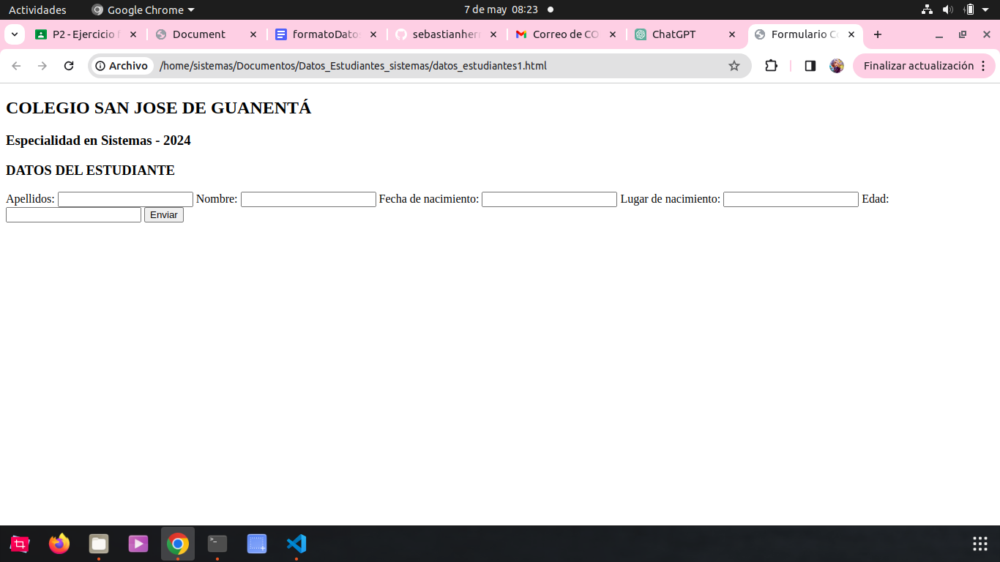
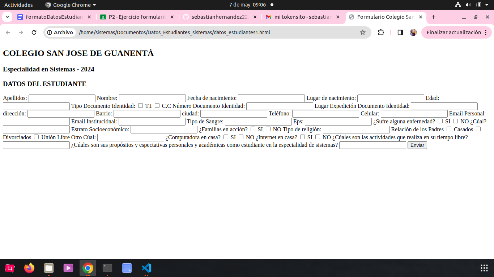
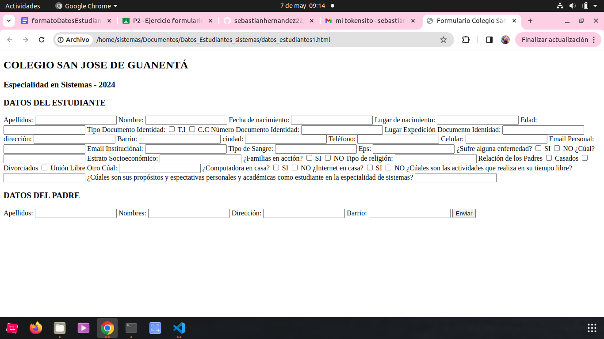

# Datos_Estudiantes_sistemas

## Primer commit
- empezé a crear el apartado de datos del estudiante sin css

## Segundo commit
- termino el apartado de datos del estudiante sin css

## Tercer commit
- empiézo con el apartado de datos del padre

